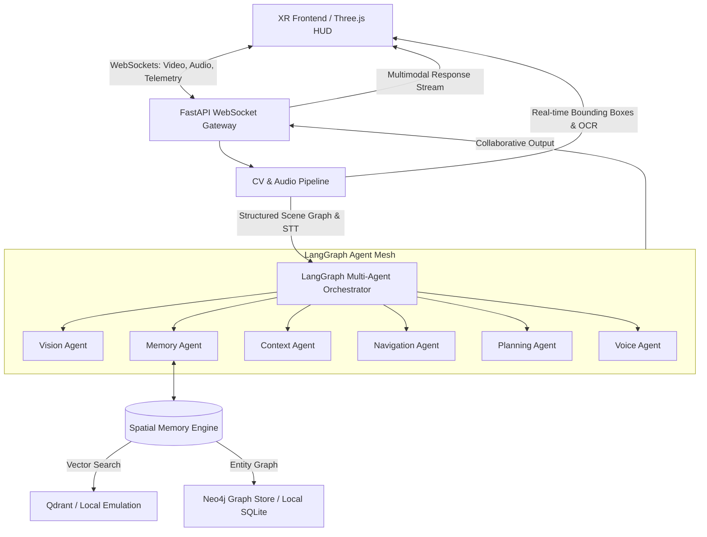

# XR Astra ✨
> **Tagline:** A real-time multimodal AI spatial assistant for smart glasses and immersive environments.

XR Astra is a production-grade, highly optimized, real-time spatial AI operating system designed for next-generation smart glasses HUDs and XR environments. Inspired by Google DeepMind Project Astra, Android XR, and Gemini Live, it connects real-time video frames, gestures, and voice parameters with a cooperative, event-driven LangGraph-style multi-agent system and spatial graph vector RAG database.

---

## 👁️ Core System Features

1. **Futuristic Cinematic HUD Simulator:** A premium Apple Vision Pro/DeepMind-inspired smart glasses HUD simulator presenting real-time telemetry (Compass, CPU/GPU stats, signal speeds, clock vectors), spatial target highlights, and linear overlay paths.
2. **Low-Latency Vision Pipeline:** Built on OpenCV and MediaPipe, capable of processing base64 image feeds, classifying interactive hand pinch gestures, and mapping high-speed environmental contrast nodes.
3. **LangGraph Agent Mesh:** Chains specialized autonomous AI agents (**Vision, Memory, Navigation, Voice**) sharing structured memory nodes to collaborate on operative environment actions.
4. **Spatial Graph Vector RAG:** A multi-modal database layer emulating dense embedding cosine searches and node relationships maps to cache and relate physical assets.
5. **Robust Local Fallback Engine:** Features adaptive AI logic and audio waves simulator so that all spatial annotations, agent nodes, and HUD pathways are 100% interactive instantly without configured API keys.

---

## 🏗️ Platform Architecture



---

## 📂 Code Directory Blueprint

```
AR ASTRA/
├── xr-frontend/                  # React + TypeScript WebXR Application
│   ├── public/                   # Static assets, mock models
│   ├── src/
│   │   ├── components/
│   │   │   ├── SmartGlassesHud.tsx      # Hovering AR labels, compass, telemetry
│   │   │   ├── ImmersiveDashboard.tsx   # Premium spatial dashboard, telemetry grid
│   │   │   ├── VoiceVisualizer.tsx      # Glowing audio wave particle simulator
│   │   │   ├── CameraSimulator.tsx      # WebCam streamer + Scenery Selector
│   │   │   └── AgentOrchestratorView.tsx# Mind map of active agent reasoning
│   │   ├── styles/
│   │   │   └── index.css                # Cinematic glassmorphism & visual theme
│   │   ├── App.tsx                      # Layout & WebSocket manager
│   │   └── main.tsx                     # React entrypoint
│   ├── package.json
│   ├── tsconfig.json
│   └── vite.config.ts
│
├── ai-backend/                   # FastAPI + LangGraph AI Pipeline
│   ├── app/
│   │   ├── main.py               # WebSocket gateway & REST endpoints
│   │   ├── config.py             # Config & API key manager
│   │   └── pipeline/
│   │       ├── vision.py         # OpenCV, MediaPipe, Object detection
│   │       ├── agents.py         # LangGraph multi-agent orchestrator & schemas
│   │       ├── memory.py         # Vector memory & Neo4j/Local graph store
│   │       └── audio.py          # Voice stream STT/TTS engine
│   ├── requirements.txt
│   └── Dockerfile
│
├── docker-compose.yml            # Local development microservices orchestra
├── kubernetes/                   # Kubernetes production deployment manifests
│   └── deployment.yaml
│
├── scripts/                      # Testing and benchmarking
│   ├── benchmark_pipeline.py     # System latency and FPS benchmarks
│   └── run_tests.py              # PyTest test runner
```

---

## ⚡ Deployment & Startup

### Option A: Standard Local Startup (Highly Recommended)

#### 1. Launch FastAPI Backend
Ensure Python 3.10+ is installed:
```bash
cd ai-backend
pip install -r requirements.txt
uvicorn app.main:app --host 0.0.0.0 --port 8000
```

#### 2. Launch Vite Frontend
Open another terminal:
```bash
cd xr-frontend
npm install
npm run dev
```
Open **[http://localhost:3000](http://localhost:3000)** in your browser!

---

### Option B: Docker Containers Orchestration

Run both frontend and backend instantly with hot-reload mappings:
```bash
docker-compose up --build
```
- Frontend active at: **[http://localhost:3000](http://localhost:3000)**
- Backend REST core active at: **[http://localhost:8000/api/v1/health](http://localhost:8000/api/v1/health)**

---

## 📊 Benchmarking & Verification

Verify sub-100ms low-latency capability and agent transaction traces using pre-compiled diagnostic suites:

```bash
# 1. Run unit & integration test suites
python scripts/run_tests.py

# 2. Run system processing benchmarks
python scripts/benchmark_pipeline.py
```
*(Benchmarks evaluate base64 decoding loops, contour analytics, sqlite spatial queries, and multi-agent workflow chains to output overall processing timelines in milliseconds).*
